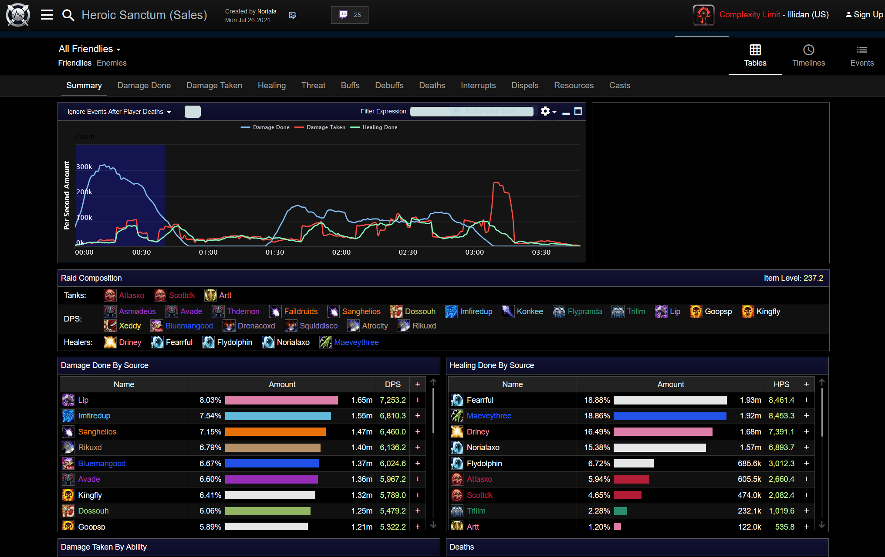

# Continuous retrospectives

TL,DR; Shortening the feedback cycle in software production is a good thing. 

## Failure in software teams

Remember an IT project that you've participated in in your past career. How long did the project run before it was declared a failure? In my experience this is typically months, if not years. Sometimes the project delivers, and if it is on-time and on-budget, it is declared a success. If not, it is a failure. For some projects they run on for months or years after delivery before it is even known whether they have actually succeeded or not. 

For many teams today, the idea is that every two weeks - as is typical for Scrum - teams come together and retrospect on what delivery has looked like over the last cycle and how they might do things better. Typically this is long enough to forget what the beginning of the fortnight was like, but not long enough to actually determine the success or failure of the endeavour that the team is currently engaged in. There is rarely any root-cause analysis, or any analysis at all, and meaningful change is typically restricted to minor tweeks to team working methods or tooling. Many action items, despite their lack of ambition, tend to float on for weeks or months with little progress.

## Failure in gaming

In gaming, failure is obvious. When your character dies, it isn't the end of your journey, just a temporary failure, a fiery full-stop in the dialogue of your story. But there is no denying it. Death, in most games, comes with a penalty that reinforces the message that you have some improvement to do, something yet to learn. In some games this is a loss of resources, in others a loss of progress, and in others a loss of time - in World of Warcraft the player is transformed into a ghost that the player must guide, slowly, through the spirit world, from the nearest graveyard back to their corpse to be revived.

In most games the loss is symbolic and of only minor inconvenience, rather than a formidable setback. It gives time to reflect on the question of "what might I do differently next time".

When you fail in a team event, the effect is more impactful, in that it is the whole team that has to do a corpse-run. This is known as a 'wipe', short for 'wipeout'. Everyone is keenly aware of their failure, there is no denying the obvious.

"In gaming, death is a learning experience"

The whole team is motivated to work harder, smarter, and do better next time. It is not unusual for a team to spend hours working on a challenge, constantly failing, resetting and either trying the same strategy again, or trying something different. At some point the team either succeeds, or gives up for the day and logs off.

## Use of data

It is quite common for teams to gather logs from the unsuccessful attempts, and analyse them for what went wrong, when, and why. Web-sites and tools like warcraftlogs.com have sprung up to facilitate this. An example wipe is shown below:

Mostly the team is well aware of what went wrong, sometimes log analysis points out issues that the team is unaware of, or vindicates a team's reasoning for the root cause of a wipe. Sometimes it enables more detailed analysis of why something went wrong. As is typical with software teams, numbers can occasionally help, but seldom tell the full story and are easily misinterpreted without the human story behind them. Sometimes the team knows exactly why they failed, and they just need to do (a thing) better, so more practice is the answer. Sometimes the team comes up with a new and easier way of doing things. Often these team strategies ('strats') are completely unique, and work due to the team's particular idiosyncratic strengths. Successful team strats rarely translate well between teams, what works well for one team may be a complete disaster for another team.

## MTBW - Mean Time Between Wipes

On boss encounters in World of Warcraft, the time taken for an unsuccessful attempt (a 'wipe') is on the order of 3-8 minutes. This is a very fast feedback cycle, which helps keep both engagement and learning levels high. 

When working with software teams, why should you have to wait for up to two weeks for the predetermined feedback slot? Why not have a mini, focussed retrospective right there and then when someone on the team notices something? In Toyota factories every employee has the power to 'stop the line', when a problem is detected, or even suspected. The team then gathers to resolve the problem and get the system back on track as soon as it is safe to do so. Why shouldn't software production be the same?

In many organisations that I've worked at there has been plenty of talk about 'empowerment' and 'autonomy', and yet when I ask a team member: "would you feel happy stopping the delivery pipeline if you suspected a problem?" their answer is almost invariably couched in uncertainty, unease and a level of covering of behinds. In short, "no", they would not feel comfortable. One might enquire to what level the team really enjoys autonomy or empowerment if they do not feel safe reporting a problem, or 'stopping the line' to fix it?

## Prior art

There has been some 'prior art' in terms of a thing referred to as 'continuous retrospectives', but this involves recording thoughts and feelings on a timeline (pre-COVID this would have been put up on a wall in the team's working area), and then using this as input at the beginning of the team's scheduled biweekly retrospective. I would hazard this is less 'continuous retrospective' and more 'continuous note-keeping'.

# Transferring knowledge and practices

It is clear that gaming/esports practices do translate to software, as the Toyota Production System shows (inspiration for David Anderson's 'Kanban' methodology). So what can we do differently?

* 'Stop the line' when a problem is discovered, or suspected. (Observe)
* Team gathers for a discussion and maybe investigation (Orient)
* Team decides on what action to take (Decide)
* Work restarts (with change) and team monitors the situation (Act) 
 
It can be seen that this process aligns closely with Boyd's OODA loop, as well as the Toyota A4 (improvement) kata. This breaks retrospectives into smaller chunks, that are used 'just in time', in much the same way that Agile methods break code into smaller chunks, which is then iteratively delivered. If continuous delivery has shown that we can deliver daily, when needed, why not retrospectives too?
